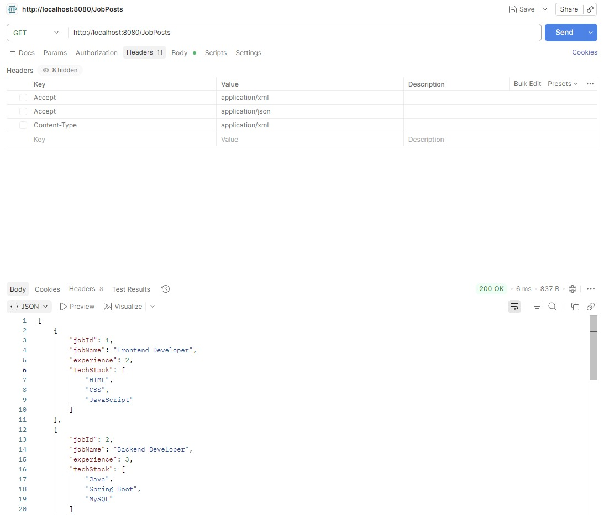
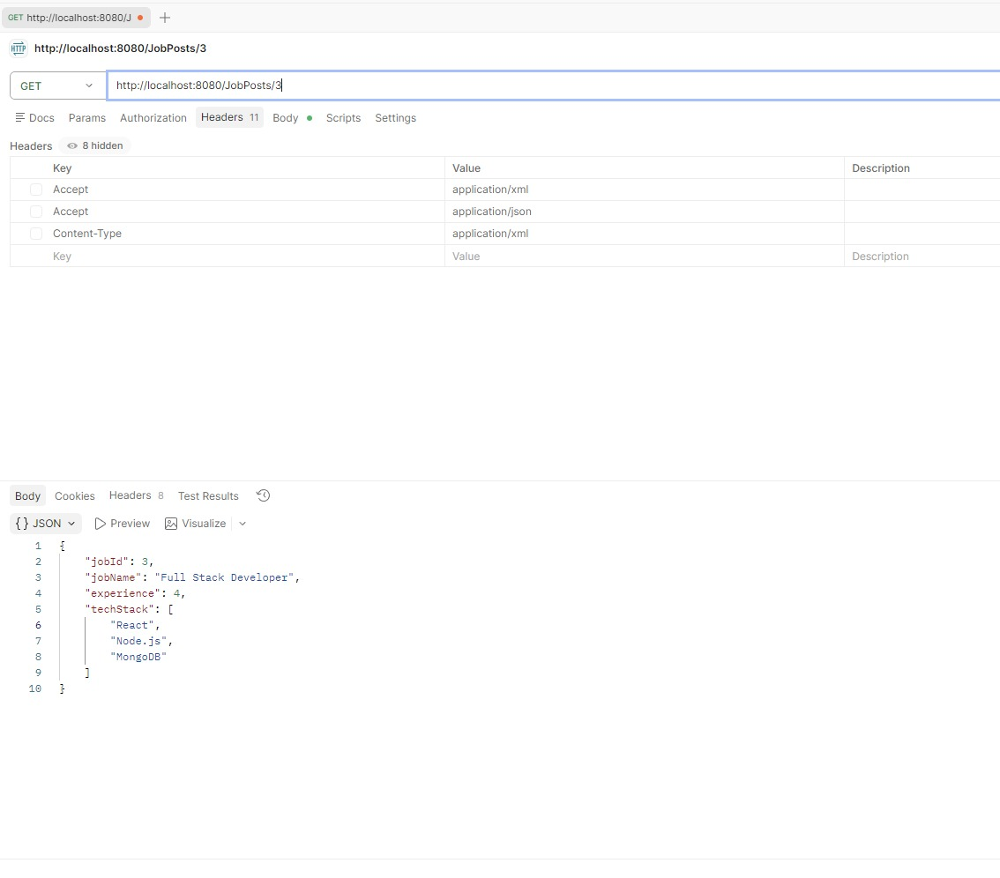
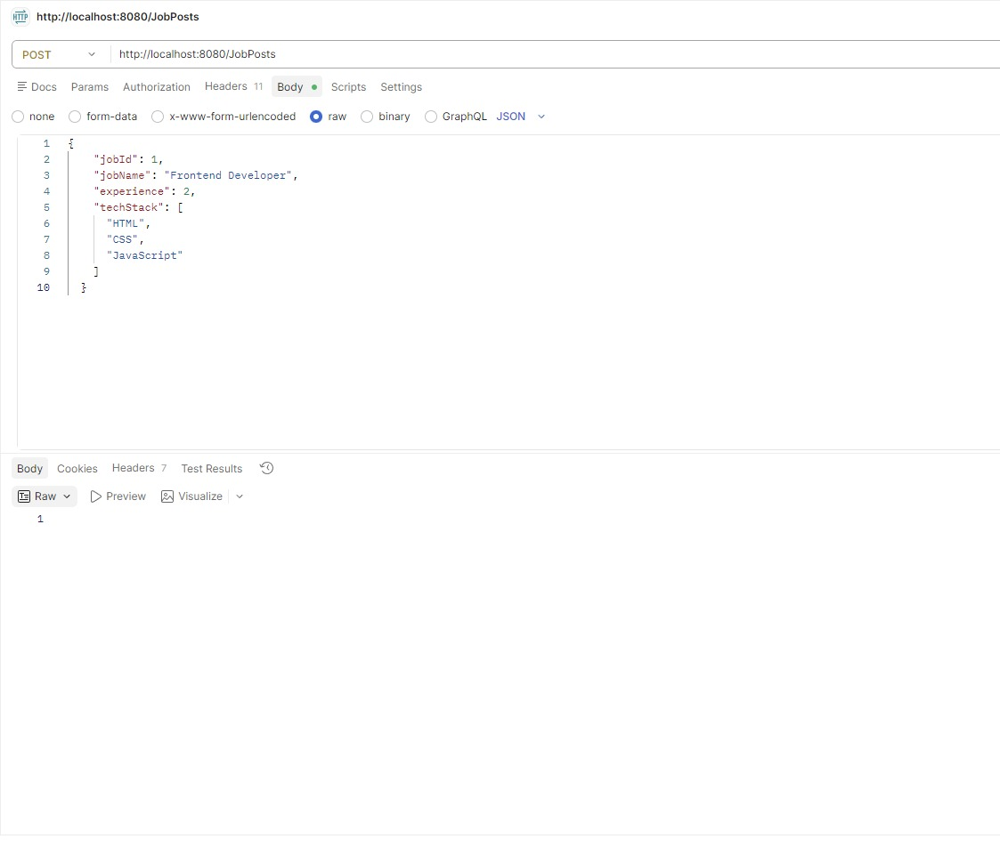
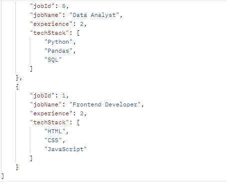
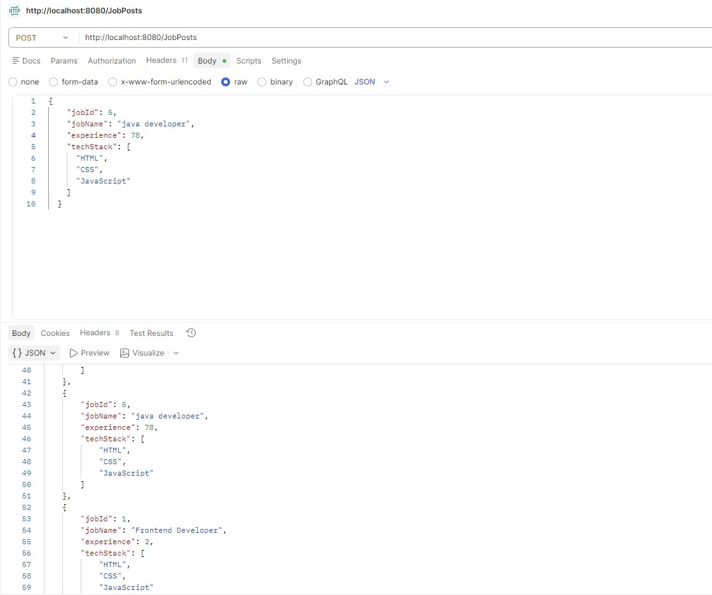
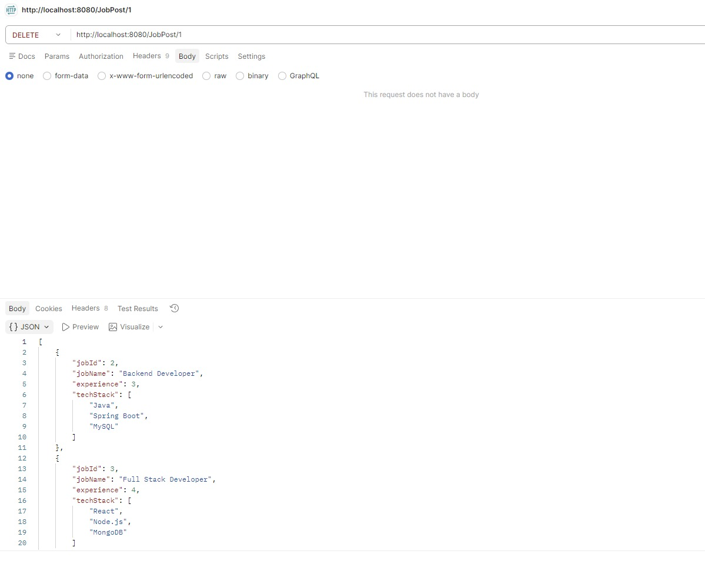
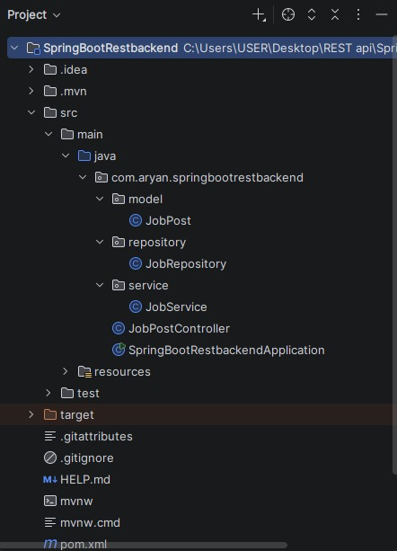

## 📚 What I Learned (Detailed)

### 🔹 REST Architecture (How APIs Work)
REST (Representational State Transfer) is a way to design APIs where the client (like React or Postman) communicates with the server using HTTP methods.

- Uses standard HTTP methods like:
  - GET → Fetch data
  - POST → Create data
  - PUT → Update data
  - DELETE → Remove data
- Stateless → Each request is independent (no memory of previous request)
- Uses URLs (endpoints) like:
  ```
  /JobPosts
  /JobPosts/1
  ```
- Data is usually transferred in JSON or XML format

---

### 🔹 `@RestController`
- Combines `@Controller` + `@ResponseBody`
- Tells Spring Boot:
  👉 “This class will handle REST API requests”
- Automatically converts Java objects into JSON/XML using Jackson

```java
@RestController
public class JobPostController {
}
```

---

### 🔹 `@GetMapping`, `@PostMapping`, `@PutMapping`, `@DeleteMapping`

These annotations map HTTP methods to Java methods:

- `@GetMapping` → Used to fetch data  
- `@PostMapping` → Used to add new data  
- `@PutMapping` → Used to update existing data  
- `@DeleteMapping` → Used to delete data  

```java
@GetMapping("/JobPosts")
@PostMapping("/JobPosts")
@PutMapping("/JobPosts")
@DeleteMapping("/JobPost/{id}")
```

---

### 🔹 `@RequestBody` & `@ResponseBody`

#### ✅ `@RequestBody`
- Converts incoming JSON data → Java object
- Used when client sends data (POST/PUT)

```java
@PostMapping("/JobPosts")
public void addJob(@RequestBody JobPost job) {
}
```

#### ✅ `@ResponseBody`
- Converts Java object → JSON/XML response
- Automatically applied when using `@RestController`

---

### 🔹 `@PathVariable`
- Used to get values from URL
- Example:
  ```
  /JobPosts/3
  ```
  Here `3` is a path variable

```java
@GetMapping("/JobPosts/{id}")
public JobPost getJob(@PathVariable int id) {
}
```

---

### 🔹 `@CrossOrigin` (React Integration)
- Solves CORS (Cross-Origin Resource Sharing) issue
- Allows frontend (React on different port) to call backend

```java
@CrossOrigin(origins = "*")
```

Without this → browser blocks API calls ❌

---

### 🔹 API Testing using Postman
- Used Postman to test all APIs
- Sent requests like:
  - GET → Fetch data
  - POST → Send JSON data
- Used:
  - Body → raw JSON
  - Headers → Content-Type & Accept

---

### 🔹 Content Negotiation (JSON & XML)
- Server can send response in different formats
- Client decides format using `Accept` header

Example:

```
Accept: application/json
Accept: application/xml
```

Spring Boot automatically converts response using Jackson

---

### 🔹 Jackson Library (JSON + XML Support)
- Jackson is used internally by Spring Boot
- Converts:
  - Java Object → JSON/XML
  - JSON/XML → Java Object

For XML support:
- Added Jackson XML dependency

---

### 🔹 HTTP Headers

#### ✅ Content-Type
- Tells server what format data is being sent in

```
Content-Type: application/json
```

#### ✅ Accept
- Tells server what format response is expected

```
Accept: application/json
Accept: application/xml
```

---

## 🏗️ Project Structure

```
src/
 └── main/
     └── java/
         └── com.aryan.springbootrestbackend/
             ├── model/
             │   └── JobPost.java
             ├── repository/
             │   └── JobRepository.java
             ├── service/
             │   └── JobService.java
             └── JobPostController.java
```

---

## 📌 API Endpoints

| Method | Endpoint | Description |
|-------|--------|-------------|
| GET | `/JobPosts` | Get all jobs |
| GET | `/JobPosts/{id}` | Get job by ID |
| POST | `/JobPosts` | Add new job |
| PUT | `/JobPosts` | Update job |
| DELETE | `/JobPost/{id}` | Delete job |

---

## 🧠 Model (JobPost)

```java
public class JobPost {
    private int jobId;
    private String jobName;
    private int experience;
    private List<String> techStack;
}
```

---

## ⚙️ Features

- In-memory data storage using `ArrayList`
- Preloaded job data
- Full CRUD operations
- RESTful API design
- JSON & XML response support
- Easy integration with frontend (React)

---

## 🔄 Content Negotiation

You can switch response format using headers:

### JSON
```
Accept: application/json
```

### XML
```
Accept: application/xml
```

---

## 🧪 Testing with Postman

- Sent requests using **raw JSON body**
- Used headers:
  - `Content-Type: application/json`
  - `Accept: application/json / application/xml`

---

## 📸 API Screenshots

### 🔹 Get All Jobs


### 🔹 Get Job By ID


### 🔹 Add Job


### 🔹 Response After Adding Job


### 🔹 Update Job


### 🔹 Delete Job


### 🔹 Project Structure


---

## 🔗 Frontend Integration

Enabled using:
```java
@CrossOrigin(origins = "*")
```

This allows frontend applications like React to communicate with the backend.

---

## 🚀 How to Run

1. Clone the repository  
2. Open in IntelliJ IDEA / VS Code  
3. Run:
```
SpringBootRestbackendApplication.java
```
4. Open browser:
```
http://localhost:8080/JobPosts
```

---

## 💡 Future Improvements

- Connect with database (MySQL / MongoDB)
- Add validation
- Add authentication (JWT)
- Deploy backend

---

## 👨‍💻 Author

**Aryan Sohani**

---
